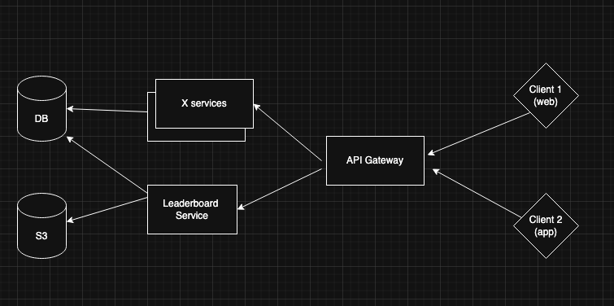

# Sunflower Assignment

### Postgres Setup
- I've created scripts to easily spin-up the project dependencies (at the moment only a postgres container)
- To setup the postgres container, and seed mock data, please run the following script: `./scripts/init.sh`.
- In case the script file lacks permissions, please run `chmod +x ./scripts/init.sh`.
- The above script will spin-up a working postgres container, login as root user, create the relevant tables and populate them with mock data

### Server Startup
- The source code is written in TS. to transpile the code into JS, please run the following command: 
```bash
npm run build
```
- Another option with hot-reload is also available: `npm run build:watch`
- To run the web-server, plase run the following command:
```bash
npm start
```
- Here as well, another option with hot-reload is available: `npm run start:watch`

### Testing
- To easily test the API, I've created a few cURL requests for each of the API endpoints.
- the commands can be found in `./scripts/curl-requests.sh`. 
- attached below: an example of a request.

```bash
# add a new user
curl \
    -X POST \
    -d accountId=test \
    -d score=44 \
    http://localhost:3000/api/scores
```

### Entity Relationship Diagram
- in this scope, there's a one-to-one relationship between accounts and account_scores, in the future, when multiple games are added, a new parameter for 'game_id' should be added to account_scores and there will be a one-to-many relationship between accounts & account_scores.


### Data Design Choices
- Even though the assignment is rather simple, I've decided to mock a real-world scenario and follow data normalization practices.
- As a result, I've created to seperate tables, one to hold information about accounts, and one to hold their respective scores.
- This makes sure any data specifically about the account is decoupled from the logic regarding the scores, this also enables partitioning/replication which is needed for scalability and redundance in real-world applications
- Each table has a unique ID as a primary key, I've decided not to go with integer IDs since they enable critical security concerns. the IDs of each entry consist of the entry's tag, followed by a random hash (e.g. account_h9g234v8)
- I didn't have the time to add a caching layer (e.g. Redis), but potentially it would improve performance in systems experiences heavy-load. 
- For example, if the request `GET /api/scores` is used often in the application to display the absolute top N scores, we can easily cache the response in Redis which will drop load from the database (since accessing the caching layer will usually be a cheaper/faster request than sending a request to the DB). This solution is viable but it does introduce complexity: if the top scores change often, we might not be able to determine when to invalidate the cache and refresh the top scores, and this is bad if the information is critical. caching-validation is a known pain-point. 
- Another use-case for caching is to cache individual user ranks.
- As for efficiency, I've decided to do the data processing in the DB itself via queries, it would be substantially more efficient to sort through the scores in the DB, and fetching only what's needed (N rows), then to fetch the entire score table and sort through the scores in the backend.
- The implementation of the queries is lacking because of time-constraints, I've used the `pg' node library to connect and query the database. in an ideal situation, I would use an generalized ORM for query management because of security concerns (for example the ORM handles input sanitization and reduces chances of successful attacks like SQL injections).
- On top of the ORM I'd probably seperate between the database handling layer and the web driver itself, ideally they should be decoupled. I'd write a seperate interface for the DB that the web-server can interact with. the interface should contain a handful of functions that are visible, such as `listScores(n), fetchScore(accountId)`, etc. and it handles all DB implementation details behind the scenes (such as efficient querying, and conversions between SQL rows and business logic entities).

### Implementation details
- I've used Postgres for the database.
- I've used ExpressJS as the web-server.
- The project is written in TypeScript.

### Misc. Comments
- This is by no means a production-ready project, there are many points of improvement which I'd love to dicuss.

### System Architechure proposal
- Different services will containerized and run in pods on any cloud provider (e.g. AWS)
- In the case of AWS, we can either rent multiple bare-bones VPS's (EC2), or use their built-in product for docker containers (ECS).
- for container orchistration, we can use k8s. one use-case is to automatically spin-up and down containers of the leaderboard service depending on the traffic. (a good option for a simple, built-in solution is EKS)
- the client doesn't directly ping the services, instead we add another machine in between which will act as a reverse proxy, aggregating and transforming the requests, setting rate limitting, etc. A good option is NGINX.
- this layer can also function as an API gateway(?), holding a the service registry to allow services to talk to eachother.
- Another layer which I haven't drawn is the caching layer, I've specified some points on caching in the above paragraphs.

