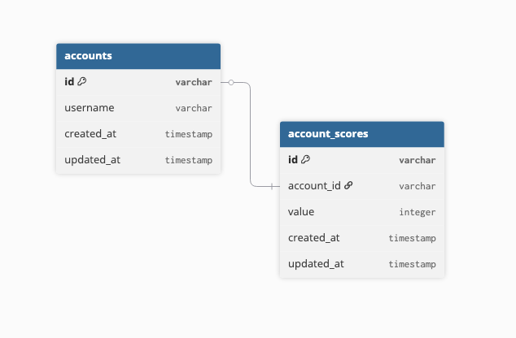

# Sunflower Assignment

### About 

###  
- This is by no means a production-ready project, there are many points of improvement, i'll specify some below:
- 

### Postgres Setup
- I've created scripts to easily spin-up the project dependencies (at the moment only a postgres container)
- To setup the postgres container, and seed mock data, please run the following script: `./scripts/init.sh`.
- In case the script file lacks permissions, please run `chmod +x ./scripts/init.sh`.
- The above script will spin-up a working postgres container, login as root user, create the relevant tables and populate them with mock data

### Web-server Start-up
- The source code is written in TS. to transpile the code into JS, please run the following command: 
```bash
npm run build
```
- Another option with hot-reload is also available: `npm run build:watch`
- To run the web-server, plase run the following command:
```bash
npm start
```
- Here as well, another option with hot-reload is available: `npm run start:watch`

### Testing
- To easily test the API, I've created a few cURL requests for each of the API endpoints.
- the commands can be found in `./scripts/curl-requests.sh`. 
- attached below: an example of a request.

```bash
# add a new user
curl \
    -X POST \
    -d accountId=test \
    -d score=44 \
    http://localhost:3000/api/scores
```

### Entity Relationship Diagram
- in this scope, there's a one-to-one relationship between accounts and account_scores, in the future, when multiple games are added, a new parameter for 'game_id' should be added to account_scores and there will be a one-to-many relationship between accounts & account_scores.
